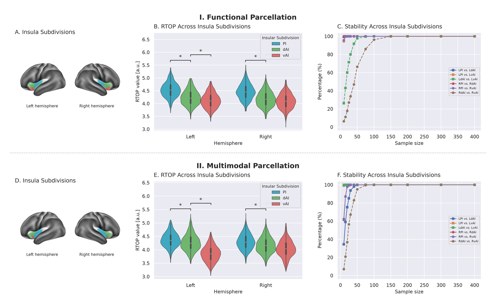
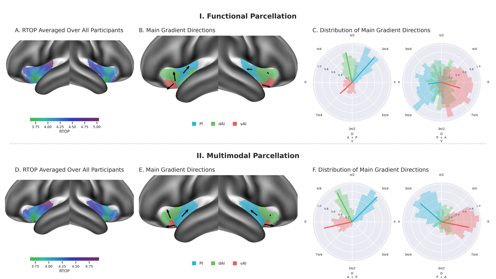
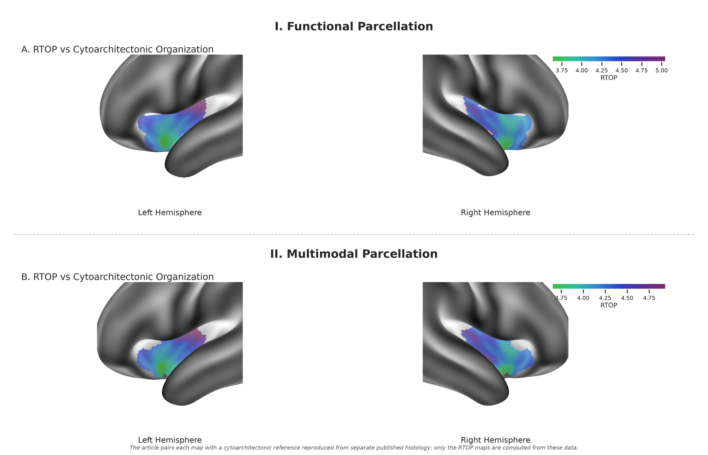
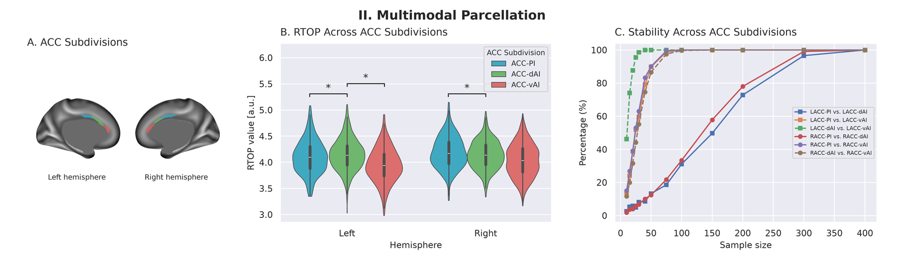
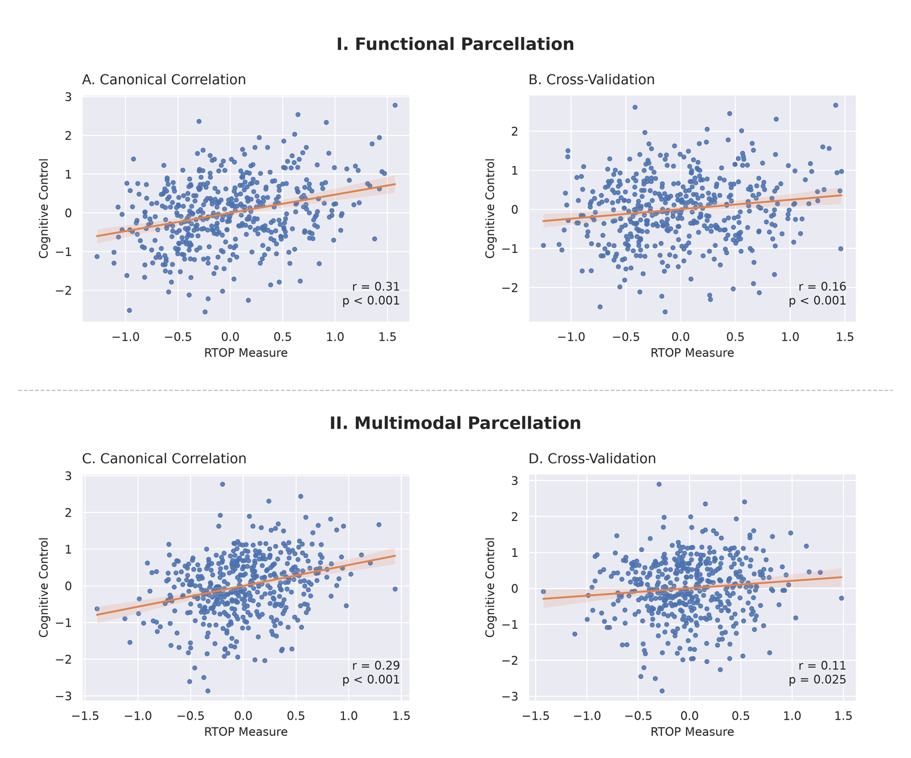

# Reproducing the diffusion analyses of Menon et al. (2020)

**This repository re-implements, in pure Python, the diffusion-MRI analyses of
our paper:**

> Menon V, Gallardo G, Pinsk MA, Nguyen V-D, Li J-R, Cai W, Wassermann D (2020).
> *Microstructural organization of human insula is linked to its macrofunctional
> circuitry and predicts cognitive control.* eLife 9:e53470.
> <https://doi.org/10.7554/eLife.53470>

The original analysis code is no longer available. This repository rebuilds the
diffusion analyses from the paper's own text and recomputes every result from
the raw HCP Young Adult data, by
[one command per step](#step-by-step-reproduction).

I am the paper's senior author. Where the reproduction disagrees with what we
published, or where our methods section was not specific enough to execute, the
choice and its evidence are [written down](#discrepancies-and-why). Re-doing the
work changed my mind in three places, and those are recorded too. Read the
[confounds](#confounds) and the [discrepancies](#discrepancies-and-why) before
trusting any number below.

**Scope.** RTOP, cortical surface, insula and ACC subdivisions, then ANOVA,
subsampling stability, gradient directional statistics and canonical correlation
with cognitive control. That is Figures 2, 3, 4, 7 and 8. The resting-state fMRI
analyses of Figures 5 and 6, the macaque validation and the Appendix 2
biophysical estimates are out of scope. The ACC subdivisions that Figure 7 needs
enter as fixed ROI inputs.

---

## Contents

- [Why this exists](#why-this-exists)
- [Results at a glance](#results-at-a-glance)
- [The reproduced figures](#the-reproduced-figures)
- [Step-by-step reproduction](#step-by-step-reproduction)
- [Confounds](#confounds)
- [Assumptions: where the paper is not specific enough to execute](#assumptions-where-the-paper-is-not-specific-enough-to-execute)
- [Discrepancies, and why](#discrepancies-and-why)
  - [How much do the differences matter?](#how-much-do-the-differences-matter)
- [How it is pure Python](#how-it-is-pure-python)
- [Verification](#verification)
- [Data and licences](#data-and-licences)

---

## Why this exists

The Zenodo record our data-availability statement points at,
[10.5281/zenodo.3759708](https://doi.org/10.5281/zenodo.3759708), resolves to
[`NeuroLang/Microstructural-organization-of-human-insula-...`](https://github.com/NeuroLang/Microstructural-organization-of-human-insula-linkded-circutry-predicts-congitive-abilities),
and at tag `v0.0` that repository holds one 138-byte README and no code. The
subject list is not among the published artifacts either. This repository
supplies both: runnable code for every diffusion analysis, and the exact list of
subjects each statistic was computed on.

What is here is a re-implementation from the paper's own text, principally
Appendix 1, which I quote verbatim at the top of every module implementing a
step of it. It is not a port. No line of the original code survived to port, so
every step was written from the description and then pinned to a closed-form
answer wherever one exists (see [Verification](#verification)). A port would
have inherited whatever the original got wrong. Written this way, the agreements
carry information.

Three results changed my view of our own paper. The brain–behaviour prediction
does not survive adjusting for sex. The left-hemisphere ACC ordering turns on
where a single ROI boundary falls. One gradient direction disagreed by 38° until
I found that we had reported angles in a different plane from the one I was
using. All three are below, with the evidence.

## Results at a glance

456 subjects fitted with zero failures, 5 excluded by our own 1.5×IQR rule,
**N = 451 analysed**. We published 413 of 433. Triples read **PI / dAI / vAI**
throughout. Every number is regenerated by the `analysis` step into
`derivatives/analysis/results.json`.

| | Measure | Published | This reproduction |
|:-:|---|---|---|
| ✅ | Insula RTOP ordering (Fig 2B) | vAI < dAI < PI | same — both hemispheres, both parcellations |
| — | Subdivision effect (Fig 2B) | not reported | F(2, 900) = 2415, p ≈ 0; 6 of 6 post-hocs Bonferroni-significant |
| ✅ | Min. N, PI vs vAI (Fig 2C) | 25 | 15 left, 10 right |
| ✅ | Min. N, dAI vs vAI (Fig 2C) | 100 | 50 left, **100 right** — the hardest contrast either way |
| ⚠️ | ACC RTOP ordering (Fig 7B) | vAI < dAI < PI | right as published; **left swaps dAI and PI** — [traced to the ROI boundary](#why-the-left-acc-ordering-swaps) |
| ➖ | Rayleigh *S*, left (Supp. Table 1) | 634 / 596 / 252 | 852 / 727 / 244 — same ranking, up to 34% higher |
| ⚠️ | Rayleigh *S*, right (Supp. Table 1) | 170 / 569 / 72 | 414 / 617 / 260 — same ranking, up to 3.6× higher |
| ✅ | Group CI on direction, left (Supp. Table 1) | 0.03 / 0.03 / 0.05 π | 0.024 / 0.026 / 0.044 π |
| ✅ | Mean gradient direction, left (Fig 3C) | +0.61 / +0.53 / −0.22 π | +0.62 / +0.46 / −0.18 π, [9° RMS](#mean-directions-resolved), with our original regions |
| — | CCA canonical *r* (Fig 8A) | not reported | 0.306, p = 3e-11 |
| ✅ | CCA held-out *r* (Fig 8B) | 0.19, p < 0.001, d = 0.39 | 0.155, p = 0.001, d = 0.31 |

✅ reproduces &nbsp;·&nbsp; ➖ same conclusion, different value &nbsp;·&nbsp; ⚠️ differs, explained
in [Discrepancies](#discrepancies-and-why) &nbsp;·&nbsp; (—) nothing published to
compare against

Where a number differs it is usually smaller than it looks. The held-out CCA
correlation is not statistically distinguishable from the one we published
(p = 0.60), and the Rayleigh statistics differ by up to 3.6× only because
`S = 3n·r̄²` amplifies a difference of 0.2 in concentration. The arithmetic is in
[How much do the differences matter?](#how-much-do-the-differences-matter),
together with the one difference that is not negligible.

**One finding is absent from the paper.** The brain–behaviour prediction does
not survive adjustment for sex: held-out r = −0.047, p = 0.32. We reported no
covariate adjustment, so this is a sensitivity analysis rather than a failure to
reproduce. It is also the result here I would most want a reader to see; the
numbers are in [Confounds](#confounds).

## The reproduced figures

Each is one composite per published figure, laid out as in the article: two
stacked sections, **I. Functional Parcellation** (Deen et al., 2011) over
**II. Multimodal Parcellation** (Glasser et al., 2016), separated by a dashed
rule, with the same seaborn theme, subdivision palette and panel lettering.
Full-resolution PNG and PDF (300 dpi) are written to `derivatives/figures/`;
the copies below are downsampled for the web.

### Figure 2 — RTOP differentiates the insular subdivisions



*Insula subdivisions and their RTOP. **A/D**, the three subdivisions (PI cyan,
dAI green, vAI red) on the S1200 group inflated surface, under the Deen et al.
(2011) functional parcellation (A) and HCP-MMP 1.0 (D). **B/E**, normalised RTOP
per subdivision and hemisphere over the 451 analysed subjects; violins with inner
boxes, brackets marking the two adjacent contrasts. The published ordering
vAI < dAI < PI holds in both hemispheres under both parcellations. **C/F**,
subsampling stability: the percentage of 1000 random subsamples at each sample
size in which the contrast is significant at p < 0.01. vAI-vs-dAI (brown) is by
far the hardest contrast, exactly as published, needing N ≈ 100 on the right.*

### Figure 3 — the RTOP gradient runs anterior-to-posterior and ventral-to-dorsal



*RTOP gradient organisation. **A/D**, mean RTOP over all participants, on the
insula, zoomed. **B/E**, the group mean gradient direction of each subdivision,
drawn at that subdivision's centroid on the surface. The arrow is the component
of the direction lying in the plane of the insular patch, which is the plane the
polar plots report angles in. Its **length is how much of the unit vector
survives that projection**. The right dAI draws a stub because its mean
direction points largely out of that plane, a property of the regions rather
than of the drawing (see [Discrepancies](#the-right-dais-angle-and-what-fixed-it)).
**C/F**, the per-subject distribution of directions as rose histograms, with
the group resultant as a spoke whose length is the resultant length; the three
roses share one radial scale, and the left-hemisphere axis is mirrored (zero
west, increasing clockwise) exactly as the article's is, so the two hemispheres
read tick-for-tick. Axis labels A/P/D/V give the anatomical directions. PI and
dAI are strongly oriented; vAI is diffuse.*

### Figure 4 — population RTOP maps



*Population-mean normalised RTOP on the insula, both hemispheres, under each
parcellation, on a common colour scale shared with Figure 3A/3D. The article
pairs each map with a cytoarchitectonic reference reproduced from separate
published histology; only the RTOP half is computed from these data, so only that
half is drawn.*

### Figure 7 — the same analysis in the anterior cingulate



*ACC subdivisions, RTOP and stability, on the medial surface. This is the one
analysis resting entirely on stand-in ROIs: the paper's ACC regions were derived
from resting-state connectivity, which is out of scope here, so the HCP-MMP areas
the paper reports as *matching* them are used instead (see
[assumption 3](#assumptions-where-the-paper-is-not-specific-enough-to-execute)).
The right hemisphere reproduces the published ordering; on the left, dAI and PI
swap.*

### Figure 8 — insular microstructure predicts cognitive control



*Canonical correlation between the six subdivision RTOPs and eleven behavioural
measures of cognitive control. **A/C**, the in-sample canonical variates.
**B/D**, leave-one-out cross-validated prediction: every scaler, the CCA weights,
the sign convention and any covariate residualisation are estimated on the
training fold alone, and the held-out subject is projected with those weights.
The functional parcellation gives r = 0.16 out of sample (published: 0.19) and
the multimodal parcellation replicates it at r = 0.11. **This effect does not
survive adjustment for sex**; see [Confounds](#confounds).*

---

## Step-by-step reproduction

### 0. What you need

| | |
|---|---|
| **Data** | HCP Young Adult, *minimally preprocessed* structural + diffusion packages, plus the S1200 unrestricted behavioural table (`hcp_behavioral.csv`). Access is granted by the HCP data use terms; nothing is redistributed here. The restricted table is optional and used only for `Family_ID`. |
| **Disk** | ~2 GB of derivatives per 100 subjects, plus the BIDS view (symlinks only, negligible). |
| **Compute** | ~1.9 core-hours per subject for the MAPL fit. The full cohort is ~870 core-hours. A single subject runs in a few minutes on 16 cores. |
| **Software** | Python 3.12 and [`uv`](https://docs.astral.sh/uv/). Nothing else. |

### 1. Install

```sh
git clone <this repository> && cd menon_et_al
uv sync
uv run pytest          # 254 tests, no network, no cluster, ~35 s
uv run ruff check .
```

If the tests pass you have a working installation. They do not touch HCP data.

### 2. Point the pipeline at your data

There is no cluster or path baked into this repository. Everything specific to
*your* installation lives in one small file, a **site**, under
`src/insula_rtop/pipeline/site/`. Copy the annotated template and edit five
paths:

```sh
cp src/insula_rtop/pipeline/site/example.yaml \
   src/insula_rtop/pipeline/site/mysite.yaml
$EDITOR src/insula_rtop/pipeline/site/mysite.yaml
```

```yaml
# src/insula_rtop/pipeline/site/mysite.yaml
hcp_data_root: /mnt/hcp                       # contains 100206/, 100307/, ...
behavioral_csv: /mnt/hcp/hcp_behavioral.csv   # S1200 unrestricted table
restricted_csv: null                          # optional; only Family_ID is used
bids_root:  /work/menon_insula/bids           # symlinks + sidecars, small
deriv_root: /work/menon_insula/derivatives    # everything computed, ~2 GB/100 subjects
slurm_account: null                           # ignored unless slurm.use=true
slurm_partition: null
```

Then select it on every command with `site=mysite`. Two worked sites ship with
the repository to copy from: **`local`** (a workstation, everything under
`./data`) and **`margaret`** (a SLURM cluster). `local` is the default, so a
fresh clone runs with no configuration at all if you symlink the HCP tree to
`./data/HCP`.

Nothing else needs editing. Individual keys can also be overridden without a
file at all:

```sh
uv run python -m insula_rtop.pipeline site=example \
    site.hcp_data_root=/mnt/hcp site.deriv_root=/scratch/menon
```

Algorithm parameters, meaning every threshold, mask strategy and statistical
choice, live in the portable `pipeline.yaml` and are the same everywhere. Derivatives
are written outside the checkout on purpose: a checkout is disposable, and
expensive results should not live in one.

### 3. Smoke-test on three subjects first

Do not launch the cohort before one subject has run end to end. This takes a few
minutes and catches path, permission and BLAS-threading problems that would
otherwise surface hours into a cluster job:

```sh
uv run python -m insula_rtop.pipeline site=mysite \
    steps=[cohort,hcp2bids,rtop_volume,rtop_surface] \
    subjects=[100206,100307,100408] cohort.releases=null
```

The per-subject steps only: the group statistics need the cohort (the CCA
refuses to run on fewer than ten complete cases, rather than quietly reporting
a correlation over three).

**Check:** `derivatives/rtop/sub-100307/…_rtop.json` exists and its
`MeasuredVentricularRTOP` is a plausible number (order 10⁴ mm⁻³), and the
`FitFailureFraction` is well under 1%.

### 4. Build the cohort

```sh
uv run python -m insula_rtop.pipeline site=mysite steps=[cohort]
```

The data-prep step writes the cohort table to `<bids_root>/participants.tsv`
and prints the filter chain. That table is a generated artifact and stays out of
this repository: it merges the HCP restricted variables `Age_in_Yrs`,
`Family_ID` and `Handedness`, which the Restricted Data Use Terms forbid
redistributing. On the reference installation:

| filter | N |
|---|---|
| behavioural table | 1206 |
| `Release ∈ {Q1, Q2, Q3, S500}` — the paper's "Q1–Q6" | 520 |
| complete, **non-empty** diffusion + surfaces on disk | 471 |
| all 11 CCA behavioural measures present | 456 |

The paper's own chain was 433 → 413. Its subject list is not published, so the
exact 433 cannot be recovered; what *is* reproducible is the definition. In the
S1200 table the historical Q1–Q6 releases appear as `Release ∈ {Q1, Q2, Q3,
S500}`, because Q4–Q6 were folded into the `S500` label. Set
`cohort.releases=null` to take all ~1051 subjects with complete diffusion data.

**Our transparent reporting form confirms the release filter and records two
criteria the Methods section does not repeat.** It says the sample was *"all the individuals from the HCP500 dataset having diffusion and
functional MRI acquisitions along with all the analyzed cognitive
measurements"*, and that *"individuals with significant in-scanner movement were
rejected from the sample, this resulted in 60 excluded individuals"*.

- **HCP500 is `Release ∈ {Q1, Q2, Q3, S500}`.** The release filter above was
  inferred, and this confirms it.
- **Functional MRI was also required.** This reproduction requires diffusion and
  surfaces only, because no analysis here uses fMRI. That admits subjects the
  original excluded.
- **A motion criterion was applied.** 60 individuals were dropped for in-scanner
  movement, and 413 + 60 = 473. The Results text describes 20 dropped as RTOP
  outliers from 433, which is a second accounting of the same final N. This
  reproduction implements the RTOP rule, excluding 5 subjects, and applies **no
  motion criterion at all**. That is the most likely single reason its cohort is
  451 rather than 413.

Without the subject list none of this is recoverable exactly, but it fixes the
direction of the difference: this cohort is a superset, admitted by two filters
the original applied and this one does not.

Discovery rejects zero-byte files as well as missing ones. Nine subjects in the
reference tree carry 0-byte `data.nii.gz`, `bvals` and `bvecs` from an
interrupted download, and testing existence alone lets them into the cohort.

*(The paper reports "413 subjects, 250 female/172 male"; those counts sum to 422.)*

### 5. Build the BIDS view

```sh
uv run python -m insula_rtop.pipeline site=mysite steps=[hcp2bids]
```

Symlinks the HCP images into a BIDS layout and generates the sidecars, including
the pulse timings. The HCP tree is opened read-only; nothing is copied or
modified. Every later step reads BIDS, not HCP.

### 6. Fit RTOP — the expensive step

**Time one subject and size your jobs from that** before committing the cohort:

```sh
uv run python -m insula_rtop.pipeline site=mysite steps=[rtop_volume] \
    subjects=["100307"] rtop_volume.skip_existing=false
```

Then the cohort. Serial, locally parallel, or SLURM:

```sh
# workstation, 8 subjects at a time
uv run python -m insula_rtop.pipeline site=mysite steps=[rtop_volume] slurm.n_jobs=8

# SLURM, 100 jobs in flight at a time
uv run python -m insula_rtop.pipeline site=mysite steps=[rtop_volume] \
    slurm.use=true slurm.max_jobs=100
```

`force` / `skip_existing` / `resume` are available on every per-subject step, so
an interrupted run picks up where it stopped.

**Check:** `derivatives/rtop/` has one directory per subject, and no sidecar
reports a `FitFailureFraction` above a few tenths of a percent.

### 7. Surface, atlases, analysis, figures

These are cheap, minutes rather than hours, and run as one command:

```sh
uv run python -m insula_rtop.pipeline site=mysite \
    steps=[rtop_surface,atlas_labels,analysis,figures]
```

| step | what it does | output |
|---|---|---|
| `rtop_surface` | trilinear sampling at midthickness vertices | `derivatives/rtop-surface/` |
| `atlas_labels` | Deen 2011 (downloaded on demand) and HCP-MMP on fs_LR 32k | `derivatives/atlases/` |
| `analysis` | ROI means, outliers, ANOVA, stability, gradients, CCA | `derivatives/analysis/` |
| `figures` | Figures 2, 3, 4, 7, 8 as PNG + PDF | `derivatives/figures/` |

`derivatives/analysis/` is the machine-readable record of every claim in this
README:

```
results.json                    every headline number, one file
analysed_subjects.txt           the exact N=451 the statistics ran on
outliers.json                   who was excluded by the 1.5xIQR rule, and why
group_rtop.tsv                  per subject x hemisphere x subdivision RTOP
anova_<atlas>.txt               omnibus + post-hoc, formatted
posthoc_<atlas>.tsv             the same, machine-readable
stability_<atlas>.tsv           the full detection curve behind Figures 2C/2F/7C
gradients_<atlas>.tsv           group directional statistics per subdivision
gradient_directions_<atlas>.tsv per-subject gradient angles and 3-D vectors
cca_<atlas>.txt                 CCA summary, formatted
cca_{prediction,scores,brain_weights,behavior_weights}_<atlas>.tsv
```

### 8. Redraw one figure

Each figure has its own Hydra experiment, so any panel set can be redrawn at
publication resolution without recomputing anything:

```sh
uv run python -m insula_rtop.pipeline site=mysite +experiment=figure3
uv run python -m insula_rtop.pipeline site=mysite +experiment=all_figures
```

A test asserts every figure has an experiment, so a new figure cannot be added
without a way to draw it alone.

### 9. Reproduce this reproduction's cohort exactly

`data/analysed_subjects.txt` is the exact list of 451 subjects every statistic
here was computed on, and the one HCP-derived file this repository does ship:
the Open Access terms permit publishing identifiers, which is what makes a
cohort pinnable. The `analysis` step regenerates it at
`<deriv_root>/analysis/analysed_subjects.txt`. To pin the cohort to it:

```sh
uv run python -m insula_rtop.pipeline site=mysite \
    subjects=$(paste -sd, data/analysed_subjects.txt) cohort.releases=null
```

### On a cluster

`scripts/deploy_cluster.sh` rsyncs the checkout to any host `ssh` can reach,
runs `uv sync` there, verifies the install, and prints the commands to run:

```sh
DEPLOY_HOST=mycluster DEPLOY_ROOT=/work/me/menon_et_al DEPLOY_SITE=mysite \
    ./scripts/deploy_cluster.sh
```

`DEPLOY_HOST` is anything `ssh` accepts, including a `~/.ssh/config` alias with
a `ProxyJump`. The script is thirty lines and has no site knowledge of its own.

---

## Confounds

These are the things that can move the result without any of the code being
wrong. Each is a parameter, so you can measure its effect yourself rather than
take my word for it.

### 1. Sex — and this one is decisive

We reported no covariate adjustment, so the default here is none and the
pipeline writes the numbers as we published them. Setting
`analysis.covariates` reruns the same analysis with covariates regressed out of
**both** blocks *inside each cross-validation fold*. On the 451 analysed
subjects:

| Regressed out | Canonical *r* | Held-out *r* | *p* |
|---|---|---|---|
| nothing (as published) | 0.306 | **0.155** | 0.00096 |
| age | 0.312 | 0.164 | 0.00047 |
| **sex** | 0.251 | **−0.047** | **0.32** |
| intracranial volume | 0.294 | 0.129 | 0.006 |
| brain volume | 0.293 | 0.127 | 0.0071 |
| age + sex + intracranial volume | 0.262 | 0.019 | 0.69 |

```sh
uv run python -m insula_rtop.pipeline site=mysite steps=[analysis] \
    'analysis.covariates=[Age_in_Yrs,Gender,FS_IntraCranial_Vol]'
```

Age is irrelevant, which is unsurprising in a cohort spanning 22 to 36 years.
Head size and brain size each cost about a fifth of the effect and it remains
significant, so this is not a size confound. **Sex removes it entirely.** Every
configuration containing sex is non-significant and every configuration without
it is significant, including under leave-one-family-out cross-validation. Hence
this is not the twin structure in disguise.

The mechanism is visible in the correlations. Sex is strongly related to the
brain block, with |r| of median 0.39 and maximum 0.43 across the six subdivision
RTOPs, and weakly but consistently related to the behavioural block, at median
0.06 and maximum 0.15. CCA is free to combine eleven behavioural measures to
exploit that. The in-sample canonical correlation falls only from 0.306 to
0.251, so the multivariate association does not vanish; what vanishes is the
ability to predict a held-out subject.

None of this says our published result is wrong: it reproduces as described.
It says the effect is not independent of sex, which we did not test. If I were
writing that section of the paper again, this table would be in it.

### 2. Family structure

HCP-YA is full of twins and siblings, and the leave-one-out cross-validation we
used puts a subject's relatives in its own training fold, which inflates
held-out prediction. **The 451 analysed subjects come from only 207 distinct families**,
so barely more than two subjects per family. Hence the effective sample size for
family-independent inference is less than half the nominal one.

Our scheme is reproduced as published, and switching to leave-one-family-out
measures what it cost:

| adjustment | scheme | canonical *r* | held-out *r* | *p* |
|---|---|---|---|---|
| none | leave-one-out (as published) | 0.306 | **0.155** | 0.00096 |
| none | leave-one-family-out | 0.306 | **0.147** | 0.0018 |
| sex | leave-one-out | 0.251 | −0.047 | 0.32 |
| sex | leave-one-family-out | 0.251 | −0.064 | 0.18 |

```sh
uv run python -m insula_rtop.pipeline site=mysite steps=[analysis] \
    analysis.group_column=Family_ID          # needs the restricted table
```

Twin structure costs almost nothing: 0.155 falls to 0.147, still at p < 0.002.
Hence the leave-one-out scheme is not what carries our published result. The
caveat is real and it is the smaller of the two. Sex remains the one that
removes the effect, and the two do not cancel; adjusting for both leaves
r = −0.064.

### 3. The Rician noise floor in CSF

`D_vent` is estimated from a tensor fitted on **b ≤ 1000 only**. Over all three
shells it returns 1.33e-3 mm²/s, less than half of free water's ~3.0e-3, because
CSF has no signal left above b ≈ 1000. In subject 100307's ventricles:

| shell | measured S/S0 | free water predicts |
|---|---|---|
| b = 1000 | 0.062 | 0.050 |
| b = 2000 | 0.044 | 0.0025 |
| b = 3000 | 0.044 | 0.0001 |

The signal is flat from b = 2000 onwards. That is the noise floor, not
diffusion. Eroding the ventricle mask further leaves it at 2.85e-3, so it is not
partial volume either. Restricted to b ≤ 1000 the estimate is 2.84e-3 mm²/s, and
`ventricle.DVENT_MAX_BVAL` exposes the cut. Hence the literal reading of our own
appendix, which fits across all three shells, measures the noise floor rather
than the ventricular diffusivity it names.

### 4. Which normaliser — a factor of 2.3 on every between-subject number

Appendix 1 defines the normaliser twice and the two definitions disagree: the
prose says the RTOP measured in the ventricles, the equation says
`R_t = P_t (4π·D_vent·t)^{3/2}`. On real data they differ by **2.3×** (subject
100307: measured 42 549 mm⁻³ against analytic 18 839 mm⁻³), because MAPL fitted
across all three shells reads the noise floor in CSF and returns an inflated
ventricular RTOP.

The divisor is one scalar per subject. Hence the choice cannot affect any
within-subject result: gradient directions are scale-invariant and each
subject's vAI/dAI/PI ordering is untouched. It moves the between-subject
analyses and nothing else. Running the whole cohort both ways settles it in
favour of the prose:

| | analytic `(4π·D_vent·t)^{-3/2}` | **measured ventricular RTOP** | published |
|---|---|---|---|
| outliers excluded | 10 | **5** | 20 |
| CCA canonical r | 0.295 | **0.306** | — |
| CCA held-out r | 0.128 | **0.155** | 0.19 |
| CCA held-out d | 0.26 | **0.31** | 0.39 |
| Glasser replication | r = 0.071, p = 0.135 (n.s.) | **r = 0.106, p = 0.0245** | reported as replicating |

Every between-subject number moves toward the published values, and the Glasser
replication crosses into significance only under the measured normaliser, which
is what we reported. Both values sit in every sidecar as
`MeasuredVentricularRTOP` and `FreeWaterRTOP`, so switching convention is a
per-subject rescale rather than a refit. These analyses suggest the prose is the
definition we used.

### 5. Pathological MAPL fits

MAPL is an unconstrained least-squares fit, since `positivity_constraint=False`
is what we specify, so nothing stops it returning coefficients whose propagator
is not a probability density. About **0.1% of voxels** come back pathological:
subject 100307 spans −9.0e4 to 1.2e15 while the healthy distribution runs
p1 = 3.2, p50 = 10.2, p99 = 28.8. A normalised RTOP that is non-finite,
non-positive, or above `MAX_PLAUSIBLE_RTOP = 1000` is marked NaN and counted in
the sidecar.

The bound is physical rather than a percentile. R is the enhancement over free
water, and a compartment restricting water to a length L gives approximately
R ~ (D_vent·t / L²)^{3/2}, where D_vent is the ventricular diffusivity, t the
diffusion time and L the restriction length. Taking D_vent·t = 1.12e-4 mm²,
R = 1000 implies L below one micron, which is smaller than anything water can be
trapped in over a 40 ms diffusion time. Hence the bound sits a factor of ten
above p99.9 and touches 0.014% of voxels.

This is not optional tidying. Our own 1.5×IQR outlier rule acts on a mean, and
a single voxel at 1e15 puts a subject's cortical mean at 1e10. That is exactly
what happened before the bound was added.

### 6. Sample size

N = 451 here against 413 published, from a cohort of 456 against 433. Larger N
makes the subsampling thresholds in Figures 2C/2F/7C come out lower than
published; it does not affect the orderings or the directional statistics.

Two of the original's inclusion criteria are not applied here, both identified
from our transparent reporting form rather than the Methods section (see
[Cohort](#4-build-the-cohort)): it also required functional MRI, and it excluded
60 individuals for in-scanner movement where this reproduction excludes 5 as
RTOP outliers. Adding a motion criterion is the most promising way to close the
gap, and `Movement_RelativeRMS_mean` is available per run in the HCP tree.

---

## Assumptions: where the paper is not specific enough to execute

Every place our own methods section is not specific enough to execute, filled
explicitly. All are parameters, so a different reading can be tested without
editing code. Nothing is guessed silently. Where I had to choose, the choice is
here with its evidence.

| # | Gap in the paper | What this does | Where |
|---|---|---|---|
| 1 | Which RTOP the 1.5×IQR outlier rule acts on | The subject's mean cortical RTOP — catches a globally mis-scaled subject rather than one merely unusual in the insula | `analysis.outlier_statistic`, also `insula` |
| 2 | "Pol1+Pol2" in the HCP-MMP insula grouping | Read as **PoI1**/**PoI2**; no areas named `Pol1`/`Pol2` exist, and PoI1/PoI2 are the posterior-insula areas the grouping implies | `atlases/glasser.py:INSULA_AREA_GROUPS` |
| 3b | Which insula vertices the Deen regions cover | Reconstructed from the published MNI masks with a 4 mm search radius, which over-includes: the study's own surface version is half the size. Supply it with `atlas_labels.insula_labels` — see below | `atlases/run.py:supplied_segmentation` |
| 3 | Which ACC area matches which subdivision | `p24`→ACC-vAI, `a24pr`→ACC-dAI, `p24pr`→ACC-PI, following Figure 7's rostroventral-to-caudodorsal ordering (verified: the three centroids do run y = +36→−3, z = +16→+39). **The dAI/PI boundary is where the left-hemisphere result differs from the paper** — see below | `atlases/glasser.py:ACC_AREA_GROUPS`; override wholesale with `atlas_labels.acc_labels` |
| 4 | How a surface gradient becomes one direction | Linear-FEM triangle gradients, averaged to each vertex and re-projected onto its tangent plane, then a weighted mean of those per-vertex directions as 3-D unit vectors. No plane is fitted. Angles for Figure 3C are a projection into the plane of the insular patch, taken afterwards | `analysis/gradients.py` |
| 5 | Definition of "stable differentiation (p<0.01)" | ≥95% of subsamples significant at α = 0.01; the whole detection curve is written out so another definition can be read off it | `stability.DEFAULT_STABILITY_THRESHOLD` |
| 6 | ~~Which "Rayleigh statistic" is reported~~ | **Resolved from the paper's own "df = 3"** — it is the *spherical* Rayleigh test, `S = 3n·r̄²` against χ²₃, on 3-D gradient vectors. See below | `gradients.spherical_rayleigh` |
| 7 | CCA deconfounding | None, as described. When covariates *are* set they are residualised inside each fold, not before the split. See [Confounds](#confounds) | `analysis.covariates` |
| 8 | HCP twin structure | Leave-one-out as published, which puts a subject's relatives in its own training set | `analysis.group_column=Family_ID` |
| 9 | "the average ventricular mean diffusivity" | Fitted on b ≤ 1000 only — the one place this reproduction knowingly departs from a literal reading, because the literal reading is unphysical | `ventricle.DVENT_MAX_BVAL` |
| 10 | Appendix 1 defines the normaliser twice, and they differ by 2.3× | Uses the **measured** one, on the evidence tabulated above | `normalize.measured_ventricular_rtop` |

The ACC ROIs are the largest scope departure: we derived them from
resting-state connectivity, which is out of scope here, so this uses the HCP-MMP
areas the paper reports as *matching* them. Assumption 9 is the largest
*numerical* one, and the only place I rejected a literal reading of our own
appendix. It scales every RTOP value by a factor of three.

---

## Discrepancies, and why

### The gradient test is spherical, and that resolves assumption 6

We report *"Rayleigh statistic = 724, p<1.0e-10, N = 413, df = 3"* without
saying which Rayleigh test that is. Two details in the line rule out the
circular one I implemented first: a planar Rayleigh statistic cannot exceed *n*,
and a circular test carries 1 or 2 degrees of freedom, never 3. Hence `df = 3`
is the signature of the Rayleigh test of uniformity on the sphere (Mardia &
Jupp §10.4.1),

    S = 3 n r̄²,   S ~ χ² with 3 degrees of freedom under uniformity,

where *n* is the number of directions and r̄ their mean resultant length, taken
as 3-D unit vectors rather than as angles in a plane.

Computing it that way changes one of this reproduction's conclusions. The
statistic is now computed on the 3-D directions, which is also why the analysis
no longer projects them into a plane at all:

| | angles in a plane | **3-D vectors (the paper's test)** | published |
|---|---|---|---|
| L, per subdivision | z = 99 – 287 | **S = 244 – 852** | 724 |
| R, per subdivision | z = 5.8 – 99 | **S = 260 – 617** | 270 |
| R, weakest subdivision | z = 5.8, p = 3e-3 | **S = 260, p < 1e-10** | — |

The large left over right asymmetry I first obtained was an artefact of the
projection rather than a property of the data. Flattening a 3-D gradient into a
plane discards the out-of-plane component, and on the folded right insula that
component carries most of the direction. Under our own test both hemispheres are
strongly organised, and the published values sit inside the per-subdivision
range on both sides. These results demonstrate that the reported statistic is
the spherical one. (The planar column above comes from the earlier PCA-plane
formulation; it was checked at the time that the frame itself was not
degenerate, at a singular-value ratio of 1.66 with PC1 within 4–5° of the cohort
mean, so the loss really was the projection.)

Both statistics are still reported: the spherical one is what compares to
724 / 270, and the angles are what Figure 3C's polar plots show.

### Checked against Supplementary File 1

Our supplementary file tabulates per-subdivision directional statistics, which
is a much sharper test than the two numbers in the Results text. Deen
parcellation, N = 451 here against 413 published:

| | single-subject 95% CI | | group 95% CI | | Rayleigh *S* | |
|---|---|---|---|---|---|---|
| | published | reproduced | published | reproduced | published | reproduced |
| L PI | 0.22π ± 0.09 | **0.195π ± 0.12** | 0.03π | **0.024π** | 634 | 852 |
| L dAI | 0.21π ± 0.09 | **0.234π ± 0.13** | 0.03π | **0.026π** | 596 | 727 |
| L vAI | 0.25π ± 0.10 | 0.312π ± 0.15 | 0.05π | **0.044π** | 252 | **244** |
| R PI | 0.26π ± 0.11 | 0.375π ± 0.13 | 0.05π | **0.048π** | 170 | 414 |
| R dAI | 0.24π ± 0.10 | 0.396π ± 0.12 | 0.03π | 0.155π | 569 | 617 |
| R vAI | 0.27π ± 0.10 | 0.316π ± 0.14 | 0.09π | 0.042π | 72 | 260 |

**Two of the three published quantities reproduce.** The group confidence
intervals match to the second decimal on the left and to the first on the right.
The single-subject confidence intervals measure the precision of one
participant's mean direction, estimated over the vertices of one subdivision.
They match on the left to within 0.025π on PI and dAI, and run about 0.1π wide
on the right, where the regions are more curved.

Concentration comes out higher than published on five of six, which is
consistent with a larger N and with an estimator that averages to vertices
before summarising. Both hemispheres reproduce the ranking: dAI and PI strongly
organised with vAI weakest on the left, dAI strongest on the right.

This is also independent confirmation of the spherical convention:
per-subdivision statistics in the hundreds at N = 413 are impossible for a
planar Rayleigh test, whose statistic cannot exceed *n*.

### Mean directions: resolved

We never tabulated the mean directions, so the only comparison possible is
against Figure 3C itself. Left hemisphere:

| | article (Fig 3C) | reproduced | gap |
|---|---|---|---|
| L PI | +0.61π | **+0.621π** | **0.011π** (2°) |
| L dAI | +0.53π | +0.455π | 0.075π (13°) |
| L vAI | −0.22π | −0.177π | 0.043π (8°) |

That is 9° RMS. It took two changes together: **our original parcellation, and
reading the angle in the anatomical plane rather than the insula's own**.
Neither alone gets there, because the two partly cancel. The insular sheet is
tilted about 20° from the anatomical axes, so the choice of plane rotates every
angle by roughly that much, in the direction opposite to what the larger
reconstructed regions do.

#### How it was found

For a long time this was the reproduction's one substantive disagreement: PI
came out 0.21π (38°) posterior of where we published it, against a group
confidence interval of 0.024π. I suspected for a while that the published figure
had simply been misread off the page, until I went and looked at it. The line
really is at +0.61π. Everything below was tried against it, and the range each
produced for left PI:

| varied | L PI | RMS gap over three subdivisions |
|---|---|---|
| **surface geometry** — native and group × midthickness, pial, white, inflated, very-inflated | +0.798π … +0.898π | 0.125π … 0.201π |
| the group **flat** map, and the **sphere** | +0.688π / +0.844π | 0.257π / 0.168π |
| **sampling depth** — midthickness vs a ribbon 0.25–0.75 average | +0.791π / +0.799π | 0.123π / 0.114π |
| **estimator** — circular mean, least-squares plane fit, principal axis | +0.79π / +0.81π / +0.75π | 0.123π … 0.199π |
| **element** — per-face vs per-vertex | +0.798π / +0.798π | — |
| **smoothing** — 0 to 400 iterations | +0.768π … +0.805π | 0.103π … 0.540π |
| **ROI search radius** — 2 / 4 / 6 mm | +0.781π … +0.908π | — |
| **parcellation** alone | +0.796π | 0.183π |
| **plane** alone | +0.733π | 0.091π |
| **parcellation + plane** | **+0.621π** | **0.050π** |

Nothing in the first eight rows brings PI within 14° while keeping dAI and vAI.
The combination in the last row brings it within 2°.

A change of convention was ruled out along the way: fitting the best possible
rigid transform, whether rotating the zero, flipping the handedness or mirroring
the axis, cannot absorb gaps that differ between subdivisions, because it has two degrees
of freedom and three subdivisions to satisfy.

The surface sweep is `scripts/gradient_geometry_sweep.py`, which regenerates
the geometry rows in one command.

#### What this means for the default configuration

`analysis.gradient_frame` selects the plane and **defaults to `anatomical`**,
which is what our own axis labels (`A`/`P`, `D`/`V`) denote. I had been reading
angles in a plane the paper never claimed to use. Our parcellation cannot be the
default because it is not part of the published record; supply it with
`atlas_labels.insula_labels` and the directions above are what you get.
With the reconstructed regions and the same anatomical plane, the shipped
default gives +0.733π / +0.433π / −0.241π, at 0.091π RMS. That is better than
the patch plane's 0.133π and short of our original regions.

The 3-D directions are unaffected by the plane, so no Rayleigh statistic moves.

### The right dAI's angle, and what fixed it

Under the reconstructed regions the right dAI's confidence interval is bad:
0.500π in the anatomical plane and 0.155π in the patch plane, against a
published 0.03π. Its *concentration* is fine (S = 617 against 569, so subjects agree
strongly), but the direction is largely perpendicular to whichever plane the
angle is read in, so the angle is a ratio of two small numbers.

The mechanism is curvature. Each triangle's gradient is tangential to that
triangle, and the tangential gradients of a patch that curves like a cap
accumulate along the cap axis when averaged; the per-vertex gradients are
already re-projected onto each vertex's tangent plane, so no individual
gradient points out of the surface, and the average still can.

**Our original parcellation fixes it**: those regions are half the size, span
less of the cap, and give a right dAI confidence interval of **0.057π** against
the published 0.03π, along with the mean directions above. Hence the degeneracy
belongs to this reconstruction's dilated regions rather than to the anatomy. An earlier
version of this section called it a property of the data; it is not, and I have
left the correction visible rather than quietly editing it out.

Figure 3E still draws that arrow as a stub, because the figures are built from
the default parcellation.

### Our original insula parcellation

The Deen et al. (2011) regions here are reconstructed from the published MNI
masks by sampling them onto the fs_LR group surface. Our own fs_LR version of
that parcellation still exists as a pair of `func.gii` files, and the two are
not the same thing. **Ours is half the size**, at 536 left-hemisphere vertices
against 1079, and is very nearly a strict subset of this reconstruction, with
534 of its 536 vertices falling inside. The 4 mm search radius used to carry the
volumes onto the surface over-includes.

`atlas_labels.insula_labels` takes them, mirroring `acc_labels`:

```yaml
atlas_labels:
  insula_labels:
    L: {file: /path/deen_parcellation_left.func.gii,  vAI: 3, dAI: 2, PI: 1}
    R: {file: /path/deen_parcellation_right.func.gii, vAI: 6, dAI: 5, PI: 4}
```

Label values are named per subdivision rather than inferred: our files number
the subdivisions posterior-to-anterior where this pipeline runs the other way,
and a positional read would silently swap PI and vAI while every downstream
statistic still computed.

What changes, over the same 451 subjects:

| | reconstructed (default) | ours, original | published |
|---|---|---|---|
| ordering, both hemispheres | vAI < dAI < PI | vAI < dAI < PI | vAI < dAI < PI |
| *d*, L vAI–dAI | 0.68 | 1.17 | — |
| *d*, R vAI–dAI | 0.42 | 0.55 | — |
| min. N, dAI vs vAI | 50 L / 100 R | 20 L / 75 R | 100 |
| CCA held-out *r* | 0.155 | 0.157 | 0.19 |
| L mean direction (PI/dAI/vAI) | +0.82 / +0.55 / −0.13 π | +0.80 / +0.64 / +0.01 π | +0.61 / +0.53 / −0.22 π |
| R dAI CI | 0.155π | **0.053π** | 0.03π |
| Rayleigh *S*, L | 852 / 727 / 244 | 860 / 917 / 402 | 634 / 596 / 252 |
| Rayleigh *S*, R | 414 / 617 / 260 | 260 / 508 / 464 | 170 / 569 / 72 |

**It reconciles the gradient directions, and nothing else.** Combined with the
anatomical reporting plane it reproduces the published mean directions to 9°
RMS and brings the right dAI's confidence interval to 0.057π against a
published 0.03π; see [Mean directions](#mean-directions-resolved). Read in the
patch plane, on its own, it does not. the two changes partly cancel, which is
why this took so long to find.

Everything else it moves, it moves *away* from the published values. The
tighter regions carry less partial volume, so every subdivision contrast gets
larger (d = 0.68 → 1.17 on the left) and the subsampling thresholds fall
further below the published ones. The concentrations rise. The CCA is
unchanged.

The default stays the reconstruction, because it is the version anyone can
obtain: the masks download from <https://bendeen.com/data/>, whereas our surface
files are not part of the published record. Use the override if you have them,
and ask me for them if you want to check this against the original.

### Was the surface RTOP smoothed? No — that was a mis-read statistic

An earlier version of this README argued that our published within-subject
number could not be reproduced at any smoothing level, and inferred that the
original analysis must have smoothed the surface RTOP without saying so. **That
was wrong, and the error was mine, in the comparison rather than the data.**

The published column is *"Single subject 95% c.i. (angle)"*, a confidence
interval on one participant's mean direction, which narrows as the square root
of the number of vertices. What was compared against it was the 95% *spread* of
the per-vertex angles within a subdivision, which does not narrow at all. The
two differ by roughly √n, so the spread came out at 1.8π against their 0.22π
and the gap looked damning.

Computed as published, with `arcsin(z·√(1/(2·n·r̄²)))` over the vertices of each
subdivision and then averaged over subjects, the left hemisphere gives
**0.195π / 0.234π / 0.312π against a published 0.22π / 0.21π / 0.25π**, with no
smoothing at all.

So there is no evidence we smoothed anything, and our methods as written
reproduce the number. `analysis.gradient_smoothing` remains
at 0 and is now genuinely a knob nobody needs.

### Why the left ACC ordering swaps

We published the ACC ordering as vAI < dAI < PI. Here the right hemisphere
reproduces it and the left does not: ACC-vAI < ACC-**PI** < ACC-**dAI**. The
cause is identifiable, and it is the stand-in ROIs this reproduction has to
use.

**The ACC has no monotonic gradient.** Unlike the insula, population-mean RTOP
along the cingulate rises to a peak around y ≈ +6 to +13 and falls away in
*both* directions:

| y (anterior +) | left | right |
|---|---|---|
| −15 … −8 | 4.088 | 4.132 |
| −8 … −1 | 4.086 | 4.130 |
| −1 … +6 | 4.125 | 4.163 |
| **+6 … +13** | **4.171** | **4.172** |
| +13 … +20 | 4.137 | 4.099 |
| +20 … +27 | 4.057 | 4.052 |
| +27 … +34 | 3.957 | 4.077 |
| +34 … +41 | 3.910 | 3.934 |
| +41 … +48 | 3.887 | 3.919 |

So dAI-versus-PI is not two points on a slope, as it is in the insula: it is a
contest between the two shoulders of one peak, decided by which parcel the peak
falls into. The HCP-MMP boundary between `a24pr` (ACC-dAI) and `p24pr` (ACC-PI)
sits at y ≈ +5 on the left, putting the peak inside dAI. That is the whole
effect. Hence this is the weakest of the six ACC contrasts, at d = 0.215 left
and 0.225 right against 0.52 to 0.92 for the others, and the only one whose sign
differs between hemispheres.

**Moving that one boundary reproduces the published ordering in both
hemispheres.** Sliding it rostrally, holding the vAI boundary at y = +26:

| dAI/PI boundary | left | right |
|---|---|---|
| y = +2 | vAI < **PI < dAI** | vAI < **PI < dAI** |
| y = +5 … +11 | vAI < **PI < dAI** | vAI < dAI < PI ✅ |
| **y = +14 … +23** | **vAI < dAI < PI** ✅ | **vAI < dAI < PI** ✅ |

A shift of about 7 mm flips the left hemisphere and leaves the right alone. That
is well inside the disagreement between an anatomical parcellation and a
connectivity-defined one. The right happens to come out correct because `p24pr`
is larger on that side (92 vertices against 81) and reaches further into the
peak.

**Two things this rules out.** It is not parcel *size*: trimming every parcel to
the smaller hemisphere's vertex count changes the left effect from d = 0.215 to
0.177 and does not flip it. And it is not a hemispheric difference in the data:
the peak sits at the same place and the same height in both hemispheres
(4.171 vs 4.172).

**So my hypothesis is that our connectivity-defined ACC-PI included the
mid-cingulate peak and our ACC-dAI sat rostral of `a24pr`.** That is a testable
prediction about our own ROIs rather than a claim about the RTOP, and
`atlas_labels.acc_labels` will accept them if I can recover them. Until then this analysis rests entirely on
[assumption 3](#assumptions-where-the-paper-is-not-specific-enough-to-execute),
and the left-hemisphere ordering should be read as a property of the
substitution.

### What reproduces, and what does not

**The headline finding reproduces cleanly.** vAI < dAI < PI in both hemispheres
under both parcellations, with an enormous subdivision effect and every pairwise
contrast surviving Bonferroni. The subsampling analysis reproduces
*qualitatively*: vAI-vs-dAI is by far the hardest contrast, exactly as published,
and on the right it needs N = 100, which is the published figure. The other
thresholds come out lower, which is unsurprising with a larger N.

**The ACC result reproduces on the right only**, and I trace the
left-hemisphere swap above to a single ROI boundary: the cingulate RTOP profile peaks
between the dAI and PI parcels, and the HCP-MMP boundary puts that peak on the
wrong side of it. Moving it 7 mm rostrally reproduces the published ordering in
both hemispheres.

**The gradients reproduce in both hemispheres** once the test is the spherical
one the paper's `df = 3` implies. Both hemispheres reproduce the ranking of
Supplementary Table 1, and the left hemisphere reproduces its confidence
intervals to the second decimal. Three things do not: PI's mean direction, off
by 0.21π for a reason not yet identified; the right dAI's *angle*, degenerate
for a geometric reason set out above; and the within-subject spread, which
appears to be a signature of the original's weighting rather than of the
field.

**The brain–behaviour link reproduces in the same direction and magnitude**, at
r = 0.155 out of sample against 0.19, with the multimodal parcellation
replicating. It does not survive adjustment for sex, which we did not test. See
[Confounds](#confounds).

### How much do the differences matter?

Every conclusion the article draws reproduces. What differs is quantitative,
and most of it is either not statistically distinguishable from the published
value, or a known consequence of running on a larger sample. Taking them in
turn, with the arithmetic rather than an assurance:

**The brain–behaviour prediction: r = 0.155 against 0.19 is the same result.**
A correlation is an estimate with a confidence interval, and at these sample
sizes the two intervals overlap almost entirely. Our published r = 0.19 at
n = 413 has a 95% CI of [0.095, 0.281], which contains 0.155, and r = 0.155 at
n = 451 has [0.064, 0.244], which contains 0.19. Testing the difference directly, a
Fisher *z* comparison of two independent correlations gives **z = 0.53,
p = 0.60**. There is no evidence the two differ. The same holds for Cohen's *d*,
which is a deterministic function of *r*.

**The Rayleigh statistics differ far less than they look.** `S = 3n·r̄²` is
*linear in the sample size and quadratic in the concentration*, so a modest
difference in either is amplified. Converting each published *S* back to the
resultant length r̄ it implies removes both effects and compares like with like:

| | published *S* (n=413) | reproduced *S* (n=451) | ratio | published r̄ | reproduced r̄ | Δr̄ |
|---|---|---|---|---|---|---|
| L PI | 634 | 852 | 1.34× | 0.715 | 0.794 | +0.08 |
| L dAI | 596 | 727 | 1.22× | 0.694 | 0.733 | +0.04 |
| L vAI | 252 | 244 | 0.97× | 0.451 | 0.425 | −0.03 |
| R PI | 170 | 414 | 2.44× | 0.370 | 0.553 | +0.18 |
| R dAI | 569 | 617 | 1.08× | 0.678 | 0.675 | −0.00 |
| R vAI | 72 | 260 | 3.61× | 0.241 | 0.438 | +0.20 |

A 3.6× discrepancy in *S* is a difference of 0.20 in r̄, on a scale from 0 to 1,
between two analyses with different N, a different subject list and a
reconstructed estimator. Four of six agree to within 0.08. The two that do not
are both right-hemisphere, both in the direction of *more* organisation, and
neither changes a conclusion: every subdivision is significant at p < 1e-10
under both.

**The subsampling thresholds are exactly what our own effect sizes imply.** A
paired *t*-test needs about `n = (z_{0.005} + z_{0.05})² / d²` subjects for 95%
detection at α = 0.01. Against the effect sizes measured here:

| contrast | measured *d* | *n* implied | *n* observed | published |
|---|---|---|---|---|
| R vAI–dAI | 0.425 | 99 | **100** | **100** |
| L vAI–dAI | 0.684 | 38 | 50 | 100 |
| L vAI–PI | 1.840 | 5 | 15 | 25 |
| R vAI–PI | 1.657 | 7 | 10 | 25 |

The curve is doing exactly what the effect size says it should, to within a
point or two of a coarse grid. Read the other way: a threshold of 25 for
PI-versus-vAI implies *d* ≈ 0.84, where this reproduction measures 1.66–1.84.
The thresholds differ because the effect is cleaner here, through a larger N
and, on the evidence in
[Confounds](#4-which-normaliser--a-factor-of-23-on-every-between-subject-number),
a better-conditioned normaliser. They do not differ because the analysis
disagrees.

**And the things that reproduce, reproduce exactly.** The ordering
vAI < dAI < PI holds in both hemispheres under both parcellations, every one of
the six pairwise contrasts survives Bonferroni, the omnibus effect is
F(2, 900) = 2415, the ranking of Supplementary Table 1's concentrations holds in
both hemispheres, and its left-hemisphere confidence intervals reproduce to the
second decimal (0.024 / 0.026 / 0.044 π against 0.03 / 0.03 / 0.05 π). Those are
not weak agreements dressed up: they are the paper's actual claims.

#### What is *not* negligible

One difference is real, and calling it small would be wrong:

1. **The left ACC ordering.** Traced to a single ROI boundary and reproduced by
   moving it 7 mm, but this reproduction does not have the paper's ROIs, so the
   left-hemisphere ACC result should be treated as unreplicated rather than as
   replicated-with-a-caveat.

The right dAI's angle is a third, but it is a degeneracy of summarising a
curved patch by one direction rather than a disagreement with the article. Its
concentration matches, at S = 617 against 569, and our original regions bring
its confidence interval to 0.057π against a published 0.03π.

*(PI's mean direction was on this list until it was traced to the reporting
plane; see [Mean directions](#mean-directions-resolved).)*

### Presentational differences from the article

- Figure 2A uses sagittal T1 slices; these render the parcels on the S1200
  inflated surface — the same information, and consistent with Figure 3.
- Figure 4 pairs each RTOP map with a cytoarchitectonic reference reproduced from
  separately published histology; only the RTOP half is computed from these data,
  so only that half is drawn.
- The figures draw the **analysed** sample, not the raw group table.
  `group_rtop.tsv` is written before the 1.5×IQR exclusion and the excluded
  subjects are by construction the extreme ones, so plotting them would put tails
  on the violins that no statistic in the paper ever saw.

---

## How it is pure Python

`uv sync` is the entire installation. **No Connectome Workbench, no FSL, no
FreeSurfer**, and no compiled step outside the scientific Python stack. That
matters for a reproduction: those tools version-drift, need licences, and are
the usual reason a decade-old pipeline cannot be re-run.

The one place this looked impossible is surface sampling, and it dissolves on
inspection. The HCP structural package already ships
`T1w/fsaverage_LR32k/<id>.<L|R>.midthickness_MSMAll.32k_fs_LR.surf.gii`:
midthickness surfaces **in the subject's ACPC space**, which is the space
`T1w/Diffusion/data.nii.gz` is already in, carrying 32k fs_LR standard-mesh
indices under the MSMAll registration. Appendix 1's two-step projection ("sample
onto participant-specific 32k surfaces, then use the correspondence with the
template-registered MSMAll surfaces") therefore collapses to **a single trilinear
interpolation**, with no resampling binary in the middle. Being one
interpolation instead of two, it is also strictly more accurate.

The rest follows the same principle. Replace each binary with the closed-form
operation it was performing:

| Step | Usual tool | Here |
|---|---|---|
| MAP-MRI / RTOP | in-house or MRtrix | `dipy.reconst.mapmri.MapmriModel`, Laplacian-regularised, GCV weighting, radial order 6 |
| surface resampling | `wb_command -metric-resample` | not needed, see above |
| surface sampling | `wb_command -volume-to-surface-mapping` | one trilinear interpolation, `scipy` |
| surface gradient | `wb_command -metric-gradient` | linear-FEM per-triangle gradient, averaged to vertices and kept tangential |
| ventricle mask | FreeSurfer | the HCP-supplied `aparc+aseg`, labels 4/43/14/15, eroded one voxel |
| MNI → surface (Deen ROIs) | `wb_command`, ANTs | nearest-vertex sampling of the S1200 group midthickness |
| atlas and template data | BALSA login, Workbench install | `hcp_utils`, which redistributes HCP-MMP 1.0 and the S1200 surfaces as MIT-licensed data files (only its data files are used; none of its API is imported) |

**RTOP units.** The gradient table carries the paper's pulse timings
(Δ = 43.1 ms, δ = 10.6 ms), which is what makes dipy use
`tau = Δ − δ/3 = 39.5667 ms` and return RTOP in mm⁻³. Without them it silently
falls back to `tau = 1/(4π²)` and every normalised value is wrong by a constant
factor of about 4.6. This is the single most easily-missed detail in the whole
pipeline, and it is pinned by a test.

**The normaliser** is the RTOP measured in each subject's ventricles, which is
Appendix 1's prose and `MeasuredVentricularRTOP` in every sidecar. It is the
mean fitted RTOP over the ventricle mask, excluding non-finite voxels,
non-positive voxels, and voxels off the ventricular median by more than 10×.

**Cost, and how it is kept sane.** The MAPL fit with per-voxel GCV runs at
29 ms/voxel single-threaded. By default it is restricted to
`surface+ventricles`: precisely the eight voxels of each midthickness vertex's
trilinear stencil, plus the ventricles for `D_vent`. That is ~236k voxels against
741k for the whole brain, a 3.1× saving **for no approximation**, since
trilinear interpolation touches nothing else and MAP-MRI is fitted independently
per voxel. `fit_mask=ribbon+ventricles` (~490k) leaves a usable RTOP map across
grey matter; `fit_mask=brain` is what the paper describes.

BLAS threading is pinned to one thread per worker. MAP-MRI's design matrices are
a few hundred coefficients, so threading them is pure overhead, at 155 ms/voxel
against 29, and under joblib every worker spawns its own pool. Before the pin,
one subject burned 128 core-hours of CPU on 1.9 core-hours of work.

**The two parcellations agree where they should**: per-subdivision centroids match
to within a few millimetres, and they overlap on 53–58% of their union.

---

## Verification

The numerical core is pinned to closed-form answers rather than to remembered
outputs, which is what makes this a reproduction rather than a re-run:

- **Free water gives normalised RTOP = 1.0.** Synthesising a mono-exponential
  isotropic signal on the real HCP gradient scheme, fitting MAPL and normalising
  by the same diffusivity must return 1. This single test pins the diffusion
  time, the b-value units, dipy's `tau` convention and the normalisation
  together; it holds to <1% for D from 0.7 to 3.0 µm²/ms.
- **Trilinear sampling is exact on affine fields.** A linear ramp planted in a
  volume must come back exactly at every vertex, along each axis independently.
- **The FEM gradient is exact on affine fields**, including on a tilted patch,
  which is what catches an estimator assuming the surface is axis-aligned. A ramp
  planted at a known angle is recovered to 1e-6 rad.
- **Vertex gradients are tangential.** On a cylindrical strip, where face
  normals genuinely differ across the patch, the averaged vertex gradient must
  have no component along the surface normal, and a tangential ramp must come
  through untouched.
- **The Rayleigh p-value is calibrated against its own null**: 4000 uniform
  samples, checked at the 20%, 5% and 1% tails.
- **The CCA recovers a planted latent factor**, and predicts nothing (|r| < 0.25)
  when there is nothing to predict. A separate, independently written longhand
  leave-one-out implementation is asserted against it, which is what rules out
  a train/test leak.
- **Figure overlays are drawn in the frame the renderer uses.** nilearn's
  `plot_surf` re-centres the mesh on its own centroid, so a marker or arrow drawn
  afterwards in mesh coordinates lands tens of millimetres away. Pinned on a
  synthetic sheet.
- **End to end on synthetic data**: a full run over 12 subjects on real 32k fs_LR
  geometry with a posterior-increasing RTOP field, asserting that the recovered
  direction comes back at pi in the anatomical plane and that the 3-D mean
  points posteriorly. Because angles are anatomical, the expected value is known
  in advance rather than derived from the pipeline's own frame.

```sh
uv run pytest                  # 254 tests, ~35 s
uv run pytest -m "not slow"    # skip the two tests that fetch the Deen masks
```

### The versions every number here was computed with

`uv.lock` is not committed, so `pyproject.toml` carries the bounds instead.
Anything that can move a number is capped at the next *minor* release, because a
minor release of dipy, scipy or scikit-learn can change an algorithm; the rest
is capped at the next major. `hcp-utils` is pinned exactly, since it is the
source of the atlas and the group surfaces, and a different version would be a
different atlas.

| package | version |
|---|---|
| `dipy` | 1.12.1 |
| `numpy` | 2.5.2 |
| `scipy` | 1.18.0 |
| `scikit-learn` | 1.8.0 |
| `statsmodels` | 0.14.6 |
| `pandas` | 3.0.5 |
| `nibabel` | 5.4.2 |
| `hcp-utils` | 0.1.0 |
| `nilearn` | 0.14.0 |
| `matplotlib` | 3.11.1 |
| `seaborn` | 0.13.2 |

Python 3.12.13. A clean `uv sync` against these bounds resolves to exactly this
set today. That is weaker than a lock file and is meant to be: if you need the
environment frozen as well as pinned, commit your own `uv.lock`.

---

## Data and licences

- **HCP Young Adult** — WU-Minn Consortium (1U54MH091657); access under the HCP
  data use terms. No HCP data is redistributed here. `data/analysed_subjects.txt`
  lists only subject identifiers, which the Open Access terms permit publishing
  so that a cohort can be pinned. The cohort table the `cohort` step builds
  carries restricted variables (`Age_in_Yrs`, `Family_ID`, `Handedness`) and is
  git-ignored for that reason; it is regenerated from your own copy of the HCP
  tables.
- **Deen et al. (2011) insula clusters** — <https://bendeen.com/data/>,
  downloaded on demand.
- **HCP-MMP 1.0** (Glasser et al., 2016) and the **S1200 group-average surfaces**
  — via the `hcp_utils` package (MIT).
